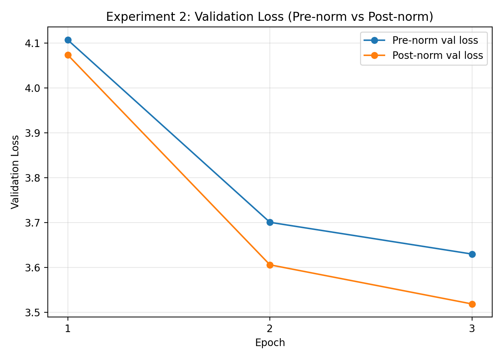
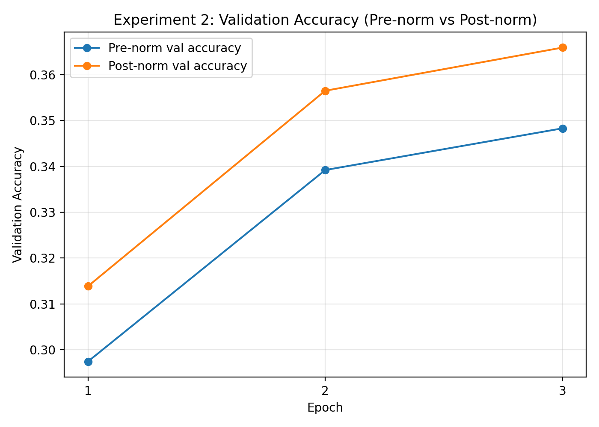

# Lab 3 Report

## Summary Block

- **baseline command:**  
  `python scripts/train_model.py --config configs/tiny.yaml`

- **baseline config:**  
  Transformer (Tiny), 4 layers, 4 heads, d_model=256

- **tokenizer path:**  
  `assets/tokenizers/english_bytebpe_8k.json`

- **checkpoint path:**  
  `checkpoints/report_tiny_3ep/best_model.pt`

- **device / hardware:**  
  NVIDIA GeForce RTX 2080 Ti (CUDA 12.4)

- **experiment 1 changed variable:**  
  Model size (Tiny vs Small)

- **experiment 2 changed variable:**  
  Normalization position (Pre-norm vs Post-norm)

- **training setup:**  
  Batch size = 16, Sequence length = 512, Epochs = 3, Precision = FP32

---

## Baseline Setup

The baseline model is a decoder-only transformer trained on the TinyStories dataset using a byte-level BPE tokenizer. The architecture consists of 4 layers, 4 attention heads, and a model dimension of 256. Sinusoidal positional encoding is used, and the model is trained using a next-token prediction objective with cross-entropy loss.

The training pipeline follows an autoregressive setup where input sequences are shifted relative to targets. Training is performed for 3 epochs on GPU to ensure sufficient convergence for comparison.

This baseline serves as the reference point for both controlled experiments.

---

## Experiment 1: Model Size (Tiny vs Small)

### What Changed

- Model size increased from **Tiny (~5M parameters)** to **Small (~13M parameters)**

### What Stayed Fixed

- Dataset (TinyStories 50k)
- Tokenizer
- Training setup (3 epochs, batch size, optimizer)
- Sequence length (512)

---

### Results (Epoch 3)

| Metric | Tiny | Small |
|------|------|------|
| Train Loss | 3.76 | 3.20 |
| Val Loss | 3.63 | 3.09 |
| Val Perplexity | 38.21 | 22.31 |
| Accuracy | 0.348 | 0.405 |
| Top-5 Accuracy | 0.591 | 0.661 |

---

### What Got Better

The small model consistently outperforms the tiny model across all metrics:
- Lower validation loss and perplexity
- Higher accuracy and top-5 accuracy
- Faster convergence after epoch 1

This indicates that increasing model capacity allows better learning of language structure even within a limited training budget.

---

### What Got Worse / Cost

- Increased parameter count (~2.5×)
- Higher GPU memory usage
- Longer training time

---

### Generation Comparison

**Tiny Model**
- Outputs contain grammatical inconsistencies
- Frequent repetition and broken phrases

**Small Model**
- More coherent sentence structure
- Better story progression
- More stable vocabulary usage

The qualitative improvement aligns with the quantitative metrics.

---
### Figures

**Validation Loss Comparison (Tiny vs Small)**

The figure shows that the small model consistently achieves lower validation loss across all epochs, indicating better convergence and learning capacity compared to the tiny model.

---

**Validation Accuracy Comparison (Tiny vs Small)**

The small model also achieves higher validation accuracy, supporting the observation that increasing model size improves performance even under limited training.
---
### Conclusion

Increasing model size improves both numerical performance and generation quality. The trade-off is increased computational cost, but the performance gain is significant even with only 3 epochs of training.

---

## Experiment 2: Normalization Position (Pre-norm vs Post-norm)

### What Changed

- Normalization placement:
  - Pre-norm (baseline)
  - Post-norm

### What Stayed Fixed

- Model size (Tiny)
- Dataset (TinyStories 50k)
- Tokenizer
- Training setup (3 epochs, batch size, optimizer)
- Sequence length (512)

---

### Results (Epoch 3)

| Metric | Pre-norm | Post-norm |
|------|---------|----------|
| Train Loss | 3.76 | 3.64 |
| Val Loss | 3.63 | 3.52 |
| Val Perplexity | 38.21 | 34.18 |
| Accuracy | 0.348 | 0.366 |
| Top-5 Accuracy | 0.591 | 0.611 |

---

### What Got Better

Post-norm achieves:
- Lower validation loss (3.52 vs 3.63)
- Lower perplexity (34.18 vs 38.21)
- Higher accuracy (0.366 vs 0.348)
- Faster improvement during early training

This indicates that post-norm provides slightly better optimization behavior under short training conditions.

---

### What Got Worse / Trade-off

- Both models still show instability due to limited training (3 epochs)
- Generation quality is not fully aligned with metric improvements

From qualitative outputs:

- **Pre-norm outputs show:**
  - Higher instability
  - Broken or malformed words (e.g., inconsistent token formation)
  - Less coherent sentence flow
    
`Once upon a time, there was a grillil old lady. It was so many things that she buried. The Tweetie was wrong and shy. So maybe the chest wanted to dance. But the children and stepped closer.`

`One day, the life came over to Why stories. He showed the doll was so much. But then themy flew away go home! It was ana meant. The old boy was too scared. They both didn't like the top and came to get land. `

- **Post-norm outputs show:**
  - Slightly improved sentence structure
  - More consistent phrasing
  - Better continuity, though still imperfect
    
`Once upon a time, was tryingJack named Jack. Jack loved to play outside and play outside in the forest. One day, Joe found a big hand in the park. Anna was very pretty holding eat Timmy and said to drink it was` `too.`

`"Maybe you ask me us, I make this?" her dad asked each other kids.`

`Then, Jack asked, "Yes, little mail?" She put some cookies that said, "Don't play hide- let's sad."`

`Timmy soon realized`

Overall, post-norm reduces some noise seen in pre-norm outputs, but neither configuration produces fully stable text at this training scale.

---

### Key Insight

There is a **partial alignment between quantitative and qualitative results**:

- **Quantitative metrics favor post-norm**
- **Qualitative outputs also slightly favor post-norm**, but the improvement is modest

This highlights that:
- Small numerical improvements do not always translate into large perceptual gains
- Short training regimes can limit visible qualitative differences

---

### Figures

**Validation Loss Comparison (Pre-norm vs Post-norm)**

Post-norm achieves slightly lower validation loss compared to pre-norm, indicating improved optimization efficiency.

---

**Validation Accuracy Comparison (Pre-norm vs Post-norm)**

Post-norm shows higher accuracy, consistent with improved training dynamics.

---

### Conclusion

Post-norm provides consistently better numerical performance under short training conditions and also shows slightly improved qualitative generation compared to pre-norm. However, both configurations remain limited by the small training budget (3 epochs), resulting in incomplete convergence and noticeable instability in generated text.

Overall, post-norm is preferable in this setup due to its better optimization behavior and marginally improved output quality, although the difference is not large. For longer training or deeper models, pre-norm may still offer advantages in stability, but this is not strongly evident in the current experiment.

## Evidence and Metrics

The experiments rely on a combination of quantitative and qualitative evaluation:

- Training and validation loss
- Perplexity
- Accuracy and top-5 accuracy
- Generated text samples (greedy and top-k decoding)

Quantitative metrics provide a consistent measure of model performance during training, while generated text samples offer insight into fluency, coherence, and stability. Using both types of evidence ensures that conclusions are not based solely on numerical improvements but also reflect actual model behavior.

---

## Generation Comparison

Generation was evaluated using:
- Greedy decoding
- Top-k sampling (k=50, temperature=0.7)

### Observations

- The **small model** produces more coherent and structured narratives compared to the tiny model
- The **tiny model** shows more instability, including repetition and inconsistent phrasing
- In normalization comparison:
  - **Pre-norm outputs** show higher instability and occasional malformed tokens
  - **Post-norm outputs** show slightly improved sentence structure and flow, though still imperfect
- Overall, improvements in metrics are reflected in generation quality, but the differences remain moderate due to limited training

This demonstrates that generation quality must be evaluated alongside numerical metrics, as small metric gains do not always lead to large perceptual improvements.

---

## Trade-off Summary

| Experiment | Benefit | Cost |
|----------|--------|------|
| Model Size | Better performance, improved generation quality | Higher compute cost and memory usage |
| Norm Position | Slight improvement in metrics and structure (post-norm) | Limited qualitative gain under short training |

---

## Limitations and Next Steps

- Only 3 epochs were used → models are not fully converged
- Limited number of generation samples → results may not generalize across prompts
- No multiple random seed runs → results may have variance
- No exploration of additional architectural variations (e.g., GQA, RoPE)

### Future Improvements

- Train for more epochs to observe stronger convergence trends
- Evaluate generation across multiple prompts and samples
- Compare models under longer training schedules
- Explore additional architectural modifications (e.g., GQA, RoPE)
- Include more rigorous statistical analysis (e.g., multiple runs with different seeds)
