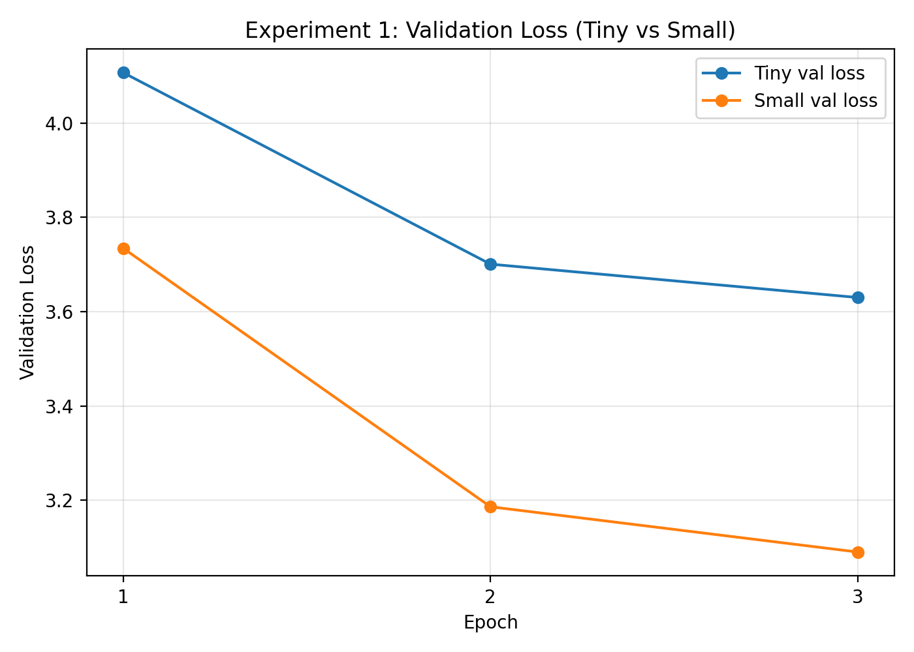
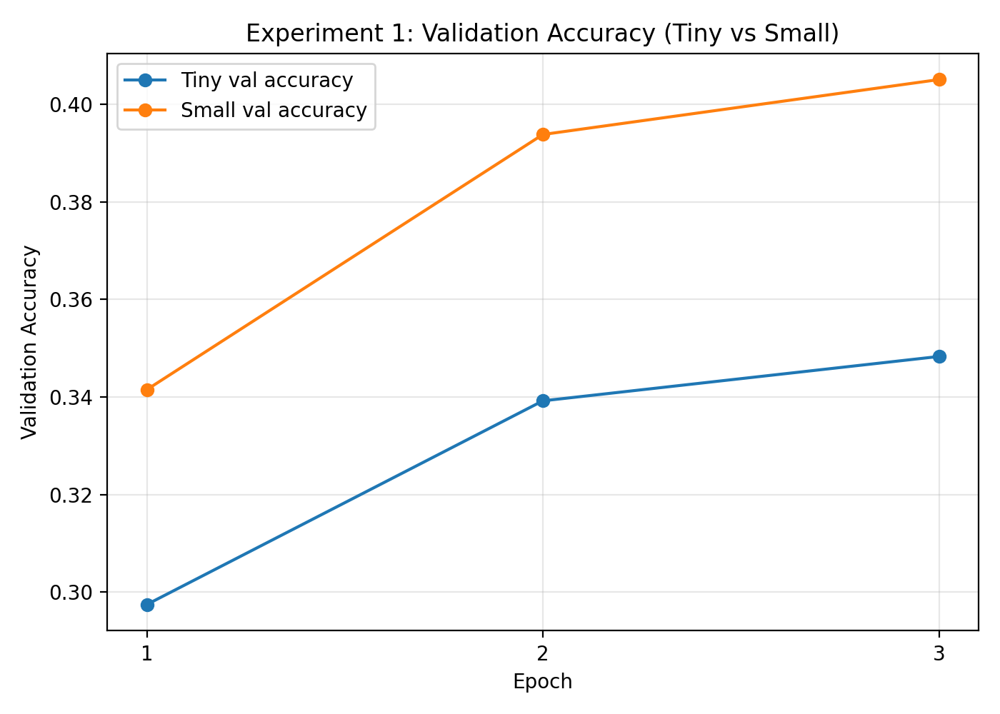

# Lab 3 Report

## Summary Block

- **baseline command:**  
  `python scripts/train_model.py --config configs/tiny.yaml`

- **baseline config:**  
  Transformer (Tiny), 4 layers, 4 heads, d_model=256

- **tokenizer path:**  
  `assets/tokenizers/english_bytebpe_8k.json`

- **checkpoint path:**  
  `checkpoints/report_tiny_3ep/best_model.pt`

- **device / hardware:**  
  NVIDIA GeForce RTX 2080 Ti (CUDA 12.4)

- **experiment 1 changed variable:**  
  Model size (Tiny vs Small)

- **experiment 2 changed variable:**  
  Normalization position (Pre-norm vs Post-norm)

- **training setup:**  
  Batch size = 16, Sequence length = 512, Epochs = 3, Precision = FP32

---

## Baseline Setup

The baseline model is a decoder-only transformer trained on the TinyStories dataset using a byte-level BPE tokenizer. The architecture consists of 4 layers, 4 attention heads, and a model dimension of 256. Sinusoidal positional encoding is used, and the model is trained using a next-token prediction objective with cross-entropy loss.

The training pipeline follows an autoregressive setup where input sequences are shifted relative to targets. Training is performed for 3 epochs on GPU to ensure sufficient convergence for comparison.

This baseline serves as the reference point for both controlled experiments.

---

## Experiment 1: Model Size (Tiny vs Small)

### What Changed

- Model size increased from **Tiny (~5M parameters)** to **Small (~13M parameters)**

### What Stayed Fixed

- Dataset (TinyStories 50k)
- Tokenizer
- Training setup (3 epochs, batch size, optimizer)
- Sequence length (512)

---

### Results (Epoch 3)

| Metric | Tiny | Small |
|------|------|------|
| Train Loss | 3.76 | 3.20 |
| Val Loss | 3.63 | 3.09 |
| Val Perplexity | 38.21 | 22.31 |
| Accuracy | 0.348 | 0.405 |
| Top-5 Accuracy | 0.591 | 0.661 |

---

### What Got Better

The small model consistently outperforms the tiny model across all metrics:
- Lower validation loss and perplexity
- Higher accuracy and top-5 accuracy
- Faster convergence after epoch 1

This indicates that increasing model capacity allows better learning of language structure even within a limited training budget.

---

### What Got Worse / Cost

- Increased parameter count (~2.5×)
- Higher GPU memory usage
- Longer training time

---

### Generation Comparison

**Tiny Model**
- Outputs contain grammatical inconsistencies
- Frequent repetition and broken phrases

**Small Model**
- More coherent sentence structure
- Better story progression
- More stable vocabulary usage

The qualitative improvement aligns with the quantitative metrics.

---
### Figures

**Validation Loss Comparison (Tiny vs Small)**

The figure shows that the small model consistently achieves lower validation loss across all epochs, indicating better convergence and learning capacity compared to the tiny model.

---

**Validation Accuracy Comparison (Tiny vs Small)**

The small model also achieves higher validation accuracy, supporting the observation that increasing model size improves performance even under limited training.
---
### Conclusion

Increasing model size improves both numerical performance and generation quality. The trade-off is increased computational cost, but the performance gain is significant even with only 3 epochs of training.

---

## Experiment 2: Normalization Position (Pre-norm vs Post-norm)

### What Changed

- Normalization placement:
  - Pre-norm (baseline)
  - Post-norm

### What Stayed Fixed

- Model size (Tiny)
- Dataset and tokenizer
- Training setup (3 epochs)

---

### Results (Epoch 3)

| Metric | Pre-norm | Post-norm |
|------|---------|----------|
| Train Loss | 3.76 | 3.64 |
| Val Loss | 3.63 | 3.52 |
| Val Perplexity | 38.21 | 34.18 |
| Accuracy | 0.348 | 0.366 |
| Top-5 Accuracy | 0.591 | 0.611 |

---

### What Got Better

Post-norm achieves:
- Slightly lower validation loss
- Slightly better accuracy
- Faster improvement in early training

---

### What Got Worse / Trade-off

- Generated outputs from post-norm show:
  - Slightly less stable sentence structure
  - Occasional incoherence

- Pre-norm outputs are:
  - More consistent
  - More stable across sentences

---

### Key Insight

There is a mismatch between:
- **Quantitative metrics (favor post-norm)**
- **Qualitative outputs (favor pre-norm)**

This highlights that metrics alone are not sufficient for evaluation.

---

### Conclusion

Post-norm improves numerical performance under short training, but pre-norm provides more stable generation. Pre-norm is generally preferred for stability, especially in deeper or longer training setups.

---

## Evidence and Metrics

The experiments rely on:
- Training and validation loss
- Perplexity
- Accuracy and top-5 accuracy
- Generated text samples (greedy and top-k)

Both quantitative and qualitative evidence are used to support conclusions.

---

## Generation Comparison

Generation was evaluated using:
- Greedy decoding
- Top-k sampling (k=50, temperature=0.7)

### Observations

- Small model produces more coherent narratives
- Tiny model struggles with fluency
- Pre-norm outputs are more stable
- Post-norm outputs show slight instability despite better metrics

This demonstrates that generation quality must be evaluated alongside numerical metrics.

---

## Trade-off Summary

| Experiment | Benefit | Cost |
|----------|--------|------|
| Model Size | Better performance, better text quality | Higher compute and memory |
| Norm Position | Slight metric improvement (post-norm) | Reduced qualitative stability |

---

## Limitations and Next Steps

- Only 3 epochs were used → models not fully converged
- Limited number of generation samples
- No multiple random seed runs
- No exploration of other architectures (e.g., GQA, RoPE)

### Future Improvements

- Train for more epochs
- Evaluate multiple prompts systematically
- Test additional architectural variations
- Include more rigorous statistical evaluation
